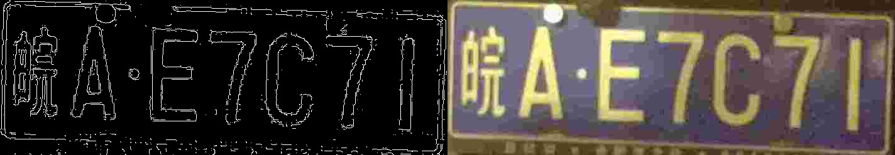
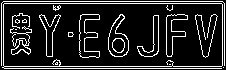
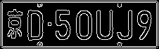
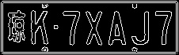
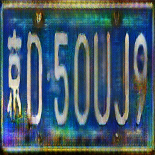

# Generate-LicensePlate-with-GAN

[](https://github.com/mingbocui/Generate-LicensePlate-with-GAN)


# Table of Contents

- [Background](#background)
- [Preparation](#preparation)
- [Training](#training)
- [Usage](#usage)
- [Problem](#problem)

## Background

**License plate detection** is a general task for most autonomous driving and computer vision comopanies. To train a license plate detector with high performance, we had to feed as many pictures into the model as possible. However, collecting real license plates will cost much resources and may infridge on strangers' privacy. One solution is to generate license plate with simple python script, just like what we provided in `genPlate.py`(Easy work, just random combinations of Characters and Digits). The problem followed by this solution is that the generated plates are all of high quality. We all know that training model with high quality images may cause your model degrade in the real world scene. Of course that you could add Gaussian noise and make some transformations on these images to lower the resolution of images delibrately. But, we could not guarantee that the generated images will have the same distribution with real world images. When talking about `distribution`, we could not ignore GAN. So here **GAN** comes to the rescue.

## Preparation
Prepare real-world licence plate dataset and put them in path ./data/B, since we gonna use pix2pix model and we need to extract the outlines of your plate images, the scripts are provided in `./scripts/extractOutline.py`

```bash
python3 extractOutline.py --A_path path/where/you/want/to/store/outlines --B_path path/stored/original/car-plate/images
```
after running the above line you could get two datasets, the outline of the license plate(**folder A**) and the original image of the   plate(**folder B**). Then you have to combine the outline and original image into ONE SINGLE image. To do that, you should run the     following lines:
  
```bash
python3 pix2pixModel/datasets/combine_A_and_B.py --fola_A /path/to/your/outline --fola_B /path/to/your/original_image --fold_AB     /path/to/store/combined/image
```
  
<p align="center">
  
</p>
<p align="center">one training set image will be composed with the original image and its corresponding outline</p>

From the image shown above, we could find that the dataset is filled with many blur and noisy images... I hope you have better dataset.

By now, you have already preprocessed the dataset, then you need to divide your dataset into three parts: train, val, test. The dataset path will be denoted as data_path in the following.

## Training
  This project uses [pix2pix](https://github.com/junyanz/pytorch-CycleGAN-and-pix2pix) model, I have already integrated them into this repository so you do not need to clone the original model.

```bash
git clone https://github.com/mingbocui/Generate-LicensePlate-with-GAN.git
```
To train the model, you need specify the data_path as shown below:

```bash
python train.py --dataroot data_path --name carPlate_pix2pix --model pix2pix --direction AtoB
```

After training with enough epochs, you will get a model which could generate realistic licence plates from the outline of scratch. 
  
  
 ## Usage
 Now we have a model which could transfer outline to realistic data, so what we need to do is to prepare the outlines, which could be divided into 2 steps: 
 
  **step 1**: run genplate.py to generate perfect license plate images. 
  > python3 scripts/genPlate.py  
 
  <p align="center">
    
    
    
  </p>
  <p align="center">Original artificial car-plate image</p>


 **step 2**: run extractOutline.py to extact the outlines of these generated images.
  ```bash
  python3 extractOutline.py --A_path path/where/you/want/to/store/outlines --B_path path/of/artificial/images
  ```

  <p align="center">
    
    
    
  </p>
  <p align="center">After extracting outlines</p>

Finally, we could deploy the trained model on the extracted outlines by running the following code:
```bash
python3 pix2pixModel/test.py --dataroot path/of/outlines --name carPlate_pix2pix --model test --netG unet_256 --direction AtoB --dataset_mode single --norm batch
```

<p align="center">
  
  
  
</p>
<p align="center">Images generated by feeding the outlines to GAN</p>


## Problem
The generated images are very blur, but this is because the original training set is very blur and noisy. And the distribution of the generated dataset is also similar to the real dataset. To improve the quality of images, maybe we need a more clean dataset.

