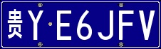
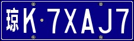

# Generate-LicensePlate-with-GAN

[](https://github.com/mingbocui/Generate-LicensePlate-with-GAN)


# Table of Contents

- [Background](#background)
- [Training](#training)
- [Usage](#usage)

## Background

**License plate detection** is a general task for most autonomous driving and computer vision comopanies. To train a license plate detector with high performance, we had to feed as many pictures into the model as possible. However, collecting real license plates will cost much resources and may infridge on strangers' privacy. One solution is to generate license plate with simple python script, just like what we provided in `genPlate.py`(Easy work, just random combinations of Characters and Digits). The problem followed by this solution is that the generated plates are all of high quality. We all know that training model with high quality images may cause your model degrade in the real world scene. Of course that you could add Gaussian noise and make some transformations on these images to lower the resolution of images delibrately. But, we could not guarantee that the generated images will have the same distribution with real world images. When talking about `distribution`, we could not ignore GAN. So here **GAN** comes to the rescue.

## Training
- Prepare real-world licence plate dataset and put them in path ./data/B, since we gonna use pix2pix model and we need to extract the outlines of your plate images, the scripts are provided in `./scripts/extractOutline.py` (Later I will add some explicit argument to configure the paths, now you need enter into the .py file and modify it directly in the code)

  ```bash
  python3 extractOutline.py --A_path path/where/you/want/to/store/outlines --B_path path/stored/original/car-plate/images
  ```
  after running the above line you could get two dataset, the outline of the license plate(folder A) and the original image of the    plate(folder B), it is not ended, you have to combine the outline and original image into ONE SINGLE image. To do that, you should run the following lines:
  
  ```bash
  python3 pix2pixModel/datasets/combine_A_and_B.py --fola_A /path/to/your/outline --fola_B /path/to/your/original_image --fold_AB /path/to/store/combined/image
  ```
  
  After training, you will get a model which could generate realistic licence plates from the outline of scratch. So now you have to prepare the outline of your artificial licence plates:
  
  generate artificial licence plates: 
  > python3 scripts/genPlate.py  
 

<p align="center">
  
  
  
</p>

## Usage

This project uses [pix2pix](https://github.com/junyanz/pytorch-CycleGAN-and-pix2pix) model, I have already integrated them into this repository so you do not need to clone the original model.

```bash
git clone https://github.com/mingbocui/Generate-LicensePlate-with-GAN.git
```
Please run genplate.py to get perfect license plate, then extract the outlines to feed into the GAN model. The GAN model deployed here is pix2pix.

step 1: run genplate.py to generate perfect license plate images. 

step 2: run extractOutline.py to extact the outlines of these generated images.

